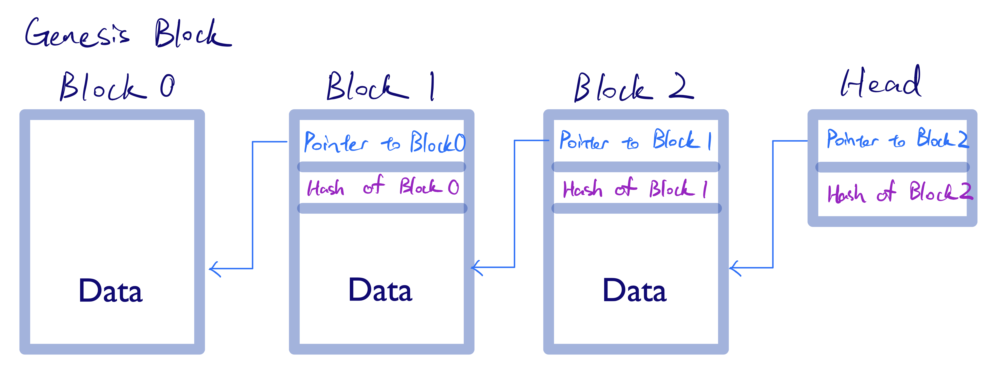

# Tamper-evident Log

## Design
A block consists of a hash pointer field and a data field.

A hash pointer consists of a pointer to the previous block and a hash digest of the previous block.

## References

1. Hash: [sha256](https://golang.org/pkg/crypto/sha256/)

2. [How to hash a struct?](https://blog.8bitzen.com/posts/22-08-2019-how-to-hash-a-struct-in-go)